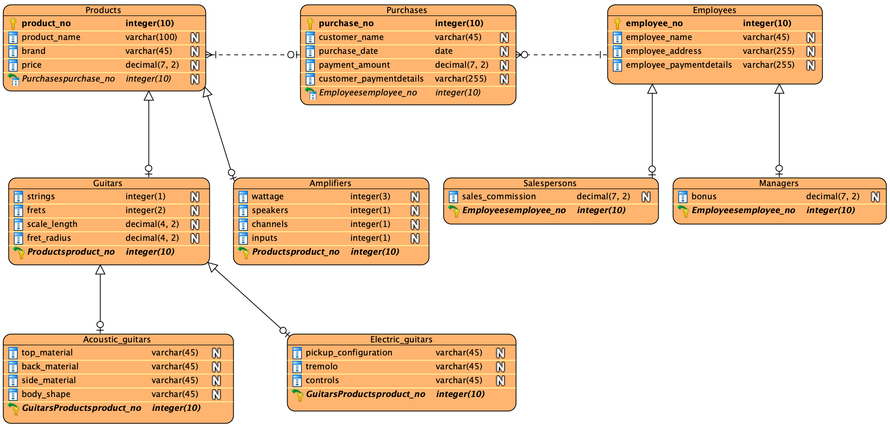

# MMGuitars
A compact MySQL schema for a brick-and-mortar guitar store (products, staff, and sales) with seed data and reporting queries.

## Features
- **5-table** relational schema with **PK/FK** constraints (InnoDB)
- **60+** seed rows
- **12 reporting queries** (joins, subqueries, aggregates, GROUP BY / HAVING / ORDER BY)
- Targeted **UPDATE/DELETE** examples
- Optional **safe teardown** (commented `DELETE`/`DROP`)

## Schema (high level)
- `Product(product_no, product_name, brand, price)`
- `Employee(employee_no, employee_name, employee_age)`
- `Salesperson(employee_no, sales_commission)` ← FK → `Employee`
- `Manager(employee_no, bonus)` ← FK → `Employee`
- `Purchase(purchase_no, customer_name, purchase_date, product_no, employee_no)` ← FKs → `Product`, `Employee`

## Entity-Relationship Diagram


## Getting started
**Requirements:** MySQL 8.0+  
**Run:**  
```bash
mysql -u <user> -p < mmguitars.sql
